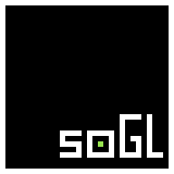

**Simple Open-Source Graphics Library**

SoGL is a simple abstraction-layer for OpenGL inspired by [raysan5's](https://github.com/zafflin) [RayLib](https://github.com/zafflin/SoGL), and [pygame-ce](https://github.com/pygame-community/pygame-ce) ( along with their epic community ).

*NOTE*: like raylib and pygame, SoGL is not there to hold your hand but rather make the learning process smoother, or challenge your knowledge.

---
<br>
<br>

[](https://github.com/zafflin/SoGL/releases)
[](https://github.com/zafflin/SoGL/stargazers)
[](https://github.com/zafflin/SoGL/commits/master)
[](LICENSE)

---
<br>
<br>

# A Simple Example
Here is probably the most basic yet rewarding example where we simply draw a triangle.
```c
#define SG_PRECOMPILE   // specify pre-compilation of default shaders
#include <sogl.h>

void main() {
    soglInit(); sgInitShapes();

    sgClearColor(25, 60, 80, 255);
    while (!sgShouldQuit(SOGL.resources.window)) {
        glfwPollEvents();

        sgBeginRender(SG_TRIANGLES);
                                    //    no uniform array, so 0 uniforms :)
        sgRender(sgDrawTriangle(NULL, &sgDShader1, NULL, 0));

        sgEndRender(SOGL.resources.window);
    }
}
```
---
<br>
<br>

# A Simple Installation
#### (NOTE) SoGL is a header only game-programming library targeting 64bit Windows. 

With all dependacies included, installation should be as simple as a few clicks. To expedite the process of going from installation to writing some actual code SoGL comes bundled with a few batch and powershell scripts: `sgInstall`, `sgBuild`, and `sgNew`.

#### (requires windows powershell)
`sgInstall`: is the installation script you should run after grabbing the library's latest [tagged-release](https://github.com/zafflin/SoGL/releases).
It will simply create a few environment variables at the user-level `SG_DIR`, `SG_INC_DIR`, and `SG_LIB_DIR` which all point to respective directories within the library. 
It then includes the `SoGL\scripts` directory to the user-level enrionment variable `PATH`. (***right-click*** `run with powershell`)

#### (requires git)
`sgNew`: is a script that will configure a new project directory for you which includes: 
- `assets/` containing some basic shaders and textures.
- `main.c` containing an example cloned from SoGL's [examples directory](https://github.com/zafflin/SoGL/tree/master/examples).
- `include/` an empty directory for other dependancies your project may require.

#### (requires mingw-gcc 64bit compiler)
`sgBuild`: is a script that will simply compile your project with necessary compiler/linker flags, and handle linking against required dependancies. e.g. `sgBuld src/main.c`

---
<br>
<br>

# A Simple Learning Resource
#### (NOTE) SoGL's Github Wiki is always open for edit. If you find any problems during your use, or believe some information may be missing, feel more than free to edit the SoGL Wiki, or open a related issue.
SoGL has a rather complex backend which drives the simplicity of the public API. With that in mind the public API does have a handfull of examples which are designed to enable you to learn on the fly.

The [SoGL Wiki]() is a treasure trove of information on how the library is designed, how it can be used, and FAQ's. 

If your ever itching to find out more about how SoGL works, or are looking for API docs, the [official repository]() should be your first stop.

---
<br>
<br>

# contributors

<a href="https://github.com/zafflin/SoGL/graphs/contributors">
  
</a>

---
<br>
<br>

# license
SoGL is licensed under an unmodified zlib/libpng license.

SoGL depends on some libraries for windowing, graphics, input+audio management and also to support various file format loading.
All SoGL dependancies are available in the `include/deps` directory.
